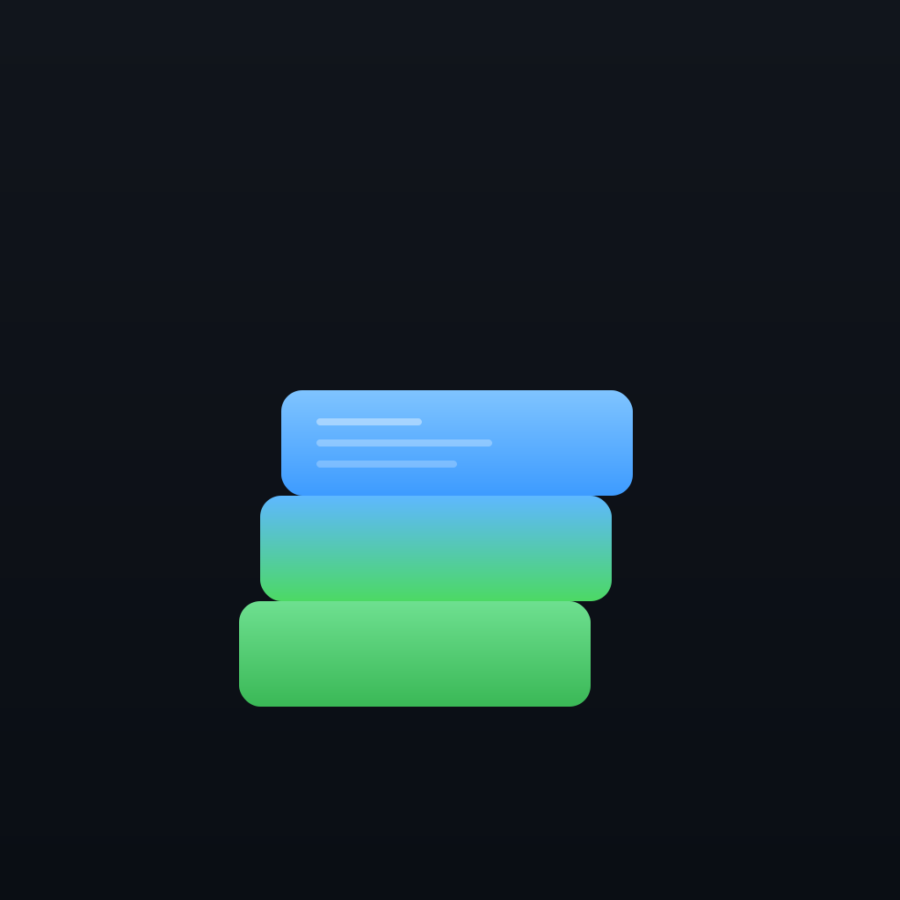

<p align="center">
  
</p>

<h1 align="center">CutX</h1>

<p align="center">
  跨平台离线文件切割与合并工具<br>
  一个二进制，跨三平台，离线运行，让百GB文件像拼图一样切割与合并。
</p>

<p align="center">
  <a href="#安装">安装</a> ·
  <a href="#快速开始">快速开始</a> ·
  <a href="#命令说明">命令说明</a> ·
  <a href="docs/PRD.md">需求文档</a>
</p>

<p align="center">
  
  
  
  
</p>

---

## 简介

CutX 是一个轻量级的命令行工具，用于将大文件（如 100GB 系统镜像）按指定大小切割为多个分片，在离线客户环境中合并还原。适用于以下场景：

- 客户服务器对单文件上传有大小限制（如 2GB）
- 客户环境为局域网离线，无法使用在线工具
- 需要跨平台（Mac/Windows/Linux）操作
- 需要数据完整性校验（MD5/SHA-256）

## 安装

从 [Releases](../../releases) 页面下载对应平台的二进制文件：

| 平台 | 文件 |
|------|------|
| macOS (Intel) | `cutx-darwin-amd64` |
| macOS (Apple Silicon) | `cutx-darwin-arm64` |
| Windows | `cutx-windows-amd64.exe` |
| Linux (x86_64) | `cutx-linux-amd64` |
| Linux (ARM64) | `cutx-linux-arm64` |

零运行时依赖，下载即可运行。

## 快速开始

```bash
# 切割 100GB 文件为 2GB 分片（默认 MD5 校验）
cutx split ubuntu-server.img -s 2G

# 校验分片完整性（传输后、合并前）
cutx verify ubuntu-server.img.manifest.json

# 快速合并（默认，不校验，速度最快）
cutx merge ubuntu-server.img.manifest.json

# 安全合并（边写边校验，数据无损保障）
cutx merge ubuntu-server.img.manifest.json --mode verify
```

## 命令说明

### cutx split

```
cutx split <源文件> [-s <切割大小>] [-o <输出目录>] [--hash <算法>]
```

| 参数 | 说明 | 默认值 |
|------|------|--------|
| `-s, --size` | 切割大小（如 2G、500M、100K） | 2G |
| `-o, --output` | 输出目录 | 源文件所在目录 |
| `--hash` | 校验算法：md5 / sha256 | md5 |
| `-q, --quiet` | 安静模式 | false |
| `-v, --verbose` | 详细日志 | false |

### cutx merge

```
cutx merge <清单文件> [-o <输出目录>] [--mode <模式>] [--force]
```

| 参数 | 说明 | 默认值 |
|------|------|--------|
| `--mode` | 合并模式：quick（不校验）/ verify（边写边校验） | quick |
| `-o, --output` | 输出目录 | 清单文件所在目录 |
| `--force` | 强制覆盖已存在的输出文件 | false |
| `-q, --quiet` | 安静模式 | false |

### cutx verify

```
cutx verify <清单文件>
```

独立校验所有分片的完整性，不执行合并。

## 退出码

| 退出码 | 含义 |
|--------|------|
| 0 | 成功 |
| 1 | 错误（参数/文件/校验失败） |
| 2 | 警告（verify 模式整体校验失败） |
| 130 | 用户中断（Ctrl+C） |

## 构建

```bash
# 编译全部 5 个平台
make all

# 仅编译当前平台
make build

# 重新生成 Windows 图标资源
make icons
```

## 技术栈

- **语言**: Go (Golang) — 静态编译单一二进制，零运行时依赖
- **CLI 框架**: Cobra
- **校验算法**: MD5（默认，速度快）/ SHA-256（合规要求）
- **交叉编译**: CGO_ENABLED=0，5 平台全覆盖

## 许可证

MIT
