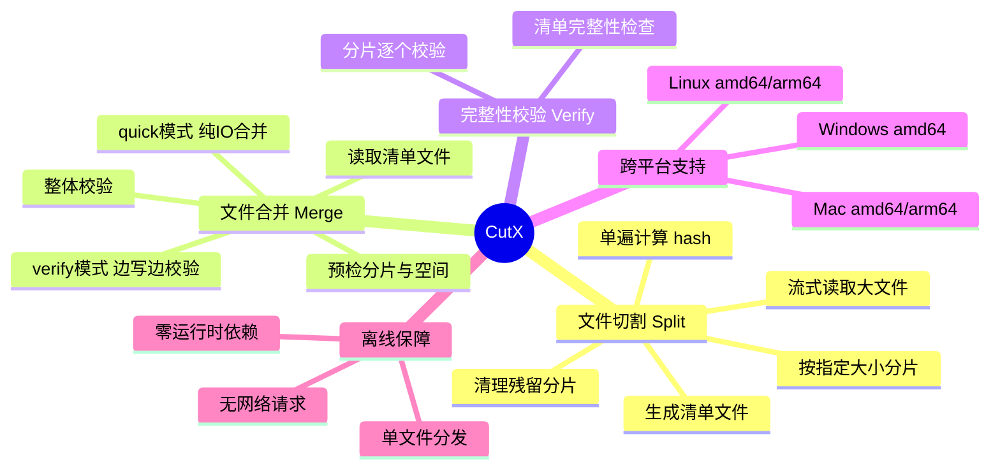
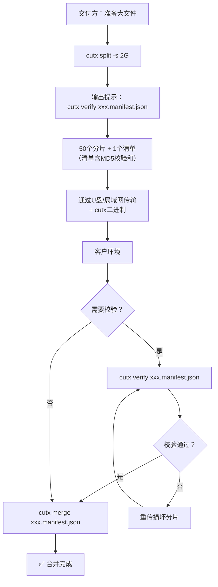

# CutX 产品需求文档 (PRD)

## 1. 文档信息

| 字段 | 内容 |
|-----|------|
| 产品名称 | CutX — 跨平台离线文件切割与合并工具 |
| 文档版本 | V3.0（经设计决策修订） |
| 编写日期 | 2026-09-11 |
| 编写人 | 产品团队 |
| 最后更新 | 2026-09-11 |
| 审核状态 | ✅ 可交付开发 |

> **V3.0 变更摘要**：引入 `--mode quick|verify` 参数（默认 quick，不校验直接合并）；MD5 替代 SHA-256 成为默认校验算法（速度优先）；split 始终在单遍流式读取中计算 hash（零额外 I/O）；分片序号改为 4 位（part0001~part9999）；split 前自动清理残留分片；merge 默认拒绝覆盖已有输出文件（`--force` 可覆盖）；移除 `--no-overall-hash`、`--skip-verify`、`--pre-verify` 等参数。

---

## 2. 项目背景

### 2.1 问题陈述

> **交付工程师**难以**将大文件（如100GB镜像）传输到客户服务器**，因为**客户环境对单文件上传有大小限制（如2GB）且为局域网离线环境**，导致**无法使用在线工具或云服务完成文件交付**。

### 2.2 业务目标

- **业务目标**：让交付工程师能在有网络的环境中快速将大文件切割为小分片，在离线客户环境中安全合并还原，全程可选保证数据零损坏。
- **量化现状**：当前一次100GB文件交付，使用系统自带 `split` 命令切割（无校验），手动逐个传输2GB文件（约50个），再手动 `cat` 合并。整个流程约4~6小时，且无法验证数据完整性——一旦某个分片传输损坏，合并后的镜像可能无法启动，且难以定位是哪个分片出了问题。

### 2.3 目标用户

| 用户类型 | 用户画像 | 核心诉求 |
|---------|---------|---------|
| 交付工程师 | 负责将大文件传输到客户服务器的技术人员，熟悉命令行操作 | 快速切割大文件，确保数据完整，操作简单 |
| 客户运维人员 | 客户环境中的运维人员，负责接收和合并文件，命令行熟悉度不一 | 在离线环境一键合并，操作简单不出错 |
| 系统管理员 | 管理备份/迁移任务的管理员，需要可脚本化调用 | 可脚本化调用，支持中断恢复 |

### 2.4 核心价值主张

> **一个二进制，跨三平台，离线运行，让百GB文件像拼图一样切割与合并。**

### 2.5 非目标（V1.0 不做）

| 非目标 | 说明 | 计划版本 |
|-------|------|---------|
| ❌ 文件压缩 | 分片为原始数据的直接字节切分，不压缩。分片总大小等于原文件大小。 | V2.0 评估 |
| ❌ 文件加密 | 分片不加密，安全性由传输环节保障。 | V2.0 评估 |
| ❌ 目录递归 | 仅处理单文件，不支持递归切割整个目录。 | 不计划 |
| ❌ 增量同步 | 不做差异比对和增量传输。 | 不计划 |
| ❌ 图形界面 | V1.0 为纯命令行工具。TUI 在 V2.0 评估。 | V2.0 评估 |
| ❌ 网络传输 | 工具不负责分片的网络传输。传输方式由用户选择。 | 不计划 |

> **设计原则**：分片文件是原始数据的直接切分（字节级拷贝），不压缩、不加密、不修改。速度优先——默认不做校验，需要完整性保障时用户显式启用 `--mode verify`。

### 2.6 成功指标

| 指标类型 | 指标名称 | 定义 | 目标 |
|---------|---------|------|------|
| **核心指标** | 全链路数据完整性 | 使用 `--mode verify` 时，切割→合并后 SHA-256/MD5 一致 | 100% |
| **输入指标** | quick 模式切割吞吐速度 | split 命令处理速度（含 hash 计算） | ≥500 MB/s |
| **输入指标** | quick 模式合并吞吐速度 | merge 命令处理速度（纯 I/O，无校验） | ≥600 MB/s |
| **护栏指标** | verify 模式校验失败中止率 | 遇到分片校验失败时必须中止合并 | 100% |
| **护栏指标** | 工具可执行率 | 工具在目标平台上首次运行即成功 | 100% |

---

## 3. 产品架构

### 3.1 功能架构图



### 3.2 用户角色定义

| 角色名称 | 角色描述 | 主要权限 |
|---------|---------|---------|
| 切割方（交付端） | 在有网络的源环境执行切割操作 | 切割、校验、查看帮助 |
| 合并方（客户端） | 在离线客户环境执行合并操作 | 合并、校验、查看帮助 |

### 3.3 用户故事

| 编号 | 用户故事 | 对应功能 |
|------|---------|---------|
| US-1 | **作为交付工程师**，我希望**指定切割大小就能把100GB文件切成2GB分片**，以便**逐个上传到有大小限制的客户服务器**。 | cutx split |
| US-2 | **作为交付工程师**，我希望**切割时自动生成清单文件和校验和**，以便**事后随时用 cutx verify 补校验，排查哪个分片损坏**。 | 清单文件 |
| US-3 | **作为客户运维人员**，我希望**执行一条命令就能校验所有分片是否完好**，以便**合并前确认传输无损**。 | cutx verify |
| US-4 | **作为客户运维人员**，我希望**默认用 quick 模式直接合并，速度最快**，以便**在离线环境快速完成交付**。 | cutx merge --mode quick |
| US-5 | **作为系统管理员**，我希望**需要完整性保障时加 --mode verify 边写边校验**，以便**在不牺牲太多速度的前提下确保数据无损**。 | cutx merge --mode verify |

---

## 4. 核心业务流程

### 4.1 端到端交付流程



### 4.2 交付前检查清单

| 检查点 | 命令 | 说明 |
|-------|------|------|
| 切割后补校验（可选） | `cutx verify xxx.manifest.json` | split 始终在清单中记录 hash，事后随时可校验 |
| 传输后校验（推荐） | `cutx verify xxx.manifest.json` | 客户环境收到文件后先校验 |
| 快速合并（默认） | `cutx merge xxx.manifest.json` | 不校验，纯 I/O，速度最快 |
| 安全合并（可选） | `cutx merge xxx.manifest.json --mode verify` | 边写边校验，数据无损保障 |

### 4.3 典型使用场景

**场景1：100GB镜像交付（快速模式）**
```bash
# 步骤1：切割（默认 quick，单遍读取含 hash 计算）
cutx split ubuntu-server-100gb.img -s 2G

# 步骤2：将 cutx 二进制 + 50个分片 + 1个清单传入客户环境

# 步骤3（可选）：客户环境校验
cutx verify ubuntu-server-100gb.img.manifest.json

# 步骤4：快速合并（默认 quick，不校验）
cutx merge ubuntu-server-100gb.img.manifest.json
```

**场景2：安全模式合并**
```bash
# 需要完整性保障时，加 --mode verify
cutx merge ubuntu-server-100gb.img.manifest.json --mode verify
```

**场景3：Windows 路径含空格**
```bash
cutx split "C:\Users\My Data\bigfile.img" -s 2G -o "D:\output\"
```

**场景4：使用 SHA-256（如有合规要求）**
```bash
cutx split bigfile.img -s 2G --hash sha256
# 后续 merge/verify 自动从清单读取算法，无需再指定
```

---

## 5. 详细功能说明

### 5.1 文件切割 (cutx split)

#### 5.1.1 功能定义

| 字段 | 说明 |
|-----|------|
| **功能编号** | F-SPLIT-01 |
| **功能描述** | 用户指定源文件路径和切割大小，工具以流式读取方式将大文件按指定大小切分为多个分片文件，单遍读取中同时计算 hash，生成清单文件 |
| **前置条件** | 源文件存在且可读，输出目录可写，磁盘空间充足 |
| **优先级** | 🔴 P0 |

#### 5.1.2 命令格式

```bash
cutx split <源文件路径> [-s <切割大小>] [-o <输出目录>] [--hash <算法>] [选项]
```

#### 5.1.3 参数说明

| 参数 | 类型 | 说明 | 默认值 | 校验规则 |
|-----|------|-----|--------|---------|
| 源文件路径 | 位置参数 | 必填，要切割的文件路径 | — | 文件必须存在且可读；符号链接跟随 |
| -s, --size | 字符串 | 切割大小，支持G/M/K单位（如2G、500M、100K）。1G=1073741824字节，1M=1048576字节，1K=1024字节 | 2G | 正整数+单位，最小1K |
| -o, --output | 路径 | 输出目录 | 源文件所在目录 | 目录可写 |
| --hash | 枚举 | 校验算法：md5/sha256。仅 split 接受此参数，merge/verify 从清单读取 | md5 | 仅接受 md5 或 sha256 |
| -q, --quiet | 布尔 | 安静模式，不显示进度 | false | — |
| -v, --verbose | 布尔 | 详细日志模式 | false | — |

> **为什么默认 MD5**：MD5 在 Go 标准库中约 500-800 MB/s，SHA-256 约 300-500 MB/s。对于检测传输过程中的意外数据损坏（位翻转、截断、丢包），MD5 完全够用。如有合规要求（金融/医疗），使用 `--hash sha256`。

#### 5.1.4 分片命名规则

- 分片文件：`{原始文件名（不含目录路径）}.part{4位序号}`，如 `data.img.part0001`、`data.img.part0002`
- 清单文件：`{原始文件名（不含目录路径）}.manifest.json`
- 序号从0001开始，四位补零
- **分片上限**：最多支持 9999 个分片。当分片数超过 9999 时，硬中止并报错退出（退出码1），提示用户增大切割大小。4位序号覆盖 9999 个分片（按 2GB 切割可处理约 20TB 文件），满足所有实际场景。
- **文件名特殊字符处理**：分片命名仅取源文件的文件名部分（不含目录路径）。如果文件名包含 `/` 或 `\`，工具报错退出。其他特殊字符（空格、中文、emoji）保留原样。
- **符号链接**：如果源文件是符号链接，工具跟随链接读取实际文件内容。分片命名使用符号链接自身的文件名。

#### 5.1.5 处理逻辑

1. 解析参数，校验源文件存在性、输出目录可写性
2. **清理残留分片**：删除输出目录中匹配 `{源文件名}.part*` 和 `{源文件名}.manifest.json` 的所有文件（以源文件名为前缀，不会误删其他文件的分片）
3. 获取源文件大小，计算分片数量
4. 检查分片数量是否 ≤ 9999，超过则报错退出
5. 以固定缓冲区（4MB）流式读取源文件
6. 每达到切割大小，关闭当前分片文件，创建下一个
7. **单遍计算 hash**：在写入每个分片的同时，并行维护两个 hash 对象——per-chunk hasher（每个分片独立）和 overall hasher（贯穿全文）。同一数据流喂给两者，不额外读数据
8. 所有分片完成后，生成清单文件（JSON格式，含 per-chunk hash 和 overall hash）
9. 输出切割摘要和提示信息（不自动执行 verify）

> **为什么单遍计算 hash**：源文件只需读一遍。4MB 缓冲区读出的数据同时写入分片文件和喂给 hasher，hash 计算速度（MD5 ≥500MB/s）远超磁盘 I/O，CPU 不是瓶颈。这意味着 overall hash 几乎零成本，清单中始终包含 hash 值，用户事后随时可用 `cutx verify` 补校验。

#### 5.1.6 进度显示

**ETA 计算方法**：基于已用时间和已处理数据量推算。`ETA = (总大小 - 已处理大小) / (已处理大小 / 已用时间)`。每秒更新一次，使用指数移动平均平滑波动。前5秒数据量不足时显示"ETA: 计算中..."。

```
[ cutx ] Splitting: ubuntu-server-100gb.img
[ cutx ] Chunk size: 2.0 GB | Total: 100.0 GB | Parts: 50
[ cutx ] ████████████████░░░░░░░░░░ 65.3% | 65.3/100.0 GB | ETA: 4m32s
[ cutx ] ✓ Done! 50 parts + manifest created in 8m15s
[ cutx ] Manifest: ubuntu-server-100gb.img.manifest.json
[ cutx ] Tip: Verify with → cutx verify ubuntu-server-100gb.img.manifest.json
[ cutx ] Tip: Merge with → cutx merge ubuntu-server-100gb.img.manifest.json
```

#### 5.1.7 异常处理

| 异常场景 | 处理方式 | 退出码 |
|---------|---------|--------|
| 源文件不存在 | 输出错误提示并退出 | 1 |
| 源文件不可读 | 输出错误提示并退出 | 1 |
| 源文件是符号链接指向不存在的目标 | 输出错误提示并退出 | 1 |
| 输出目录不存在 | 自动创建 | — |
| 输出目录不可写 | 输出错误提示并退出 | 1 |
| 磁盘空间不足 | 清理已生成的分片，输出错误提示并退出 | 1 |
| 切割大小 > 文件大小 | 生成单个分片（等于原文件大小），输出警告 | 0 |
| 切割大小无效（如0、负数、无单位） | 输出错误提示并退出 | 1 |
| 分片数量超过9999 | 输出"分片数超过上限9999，请增大切割大小"并退出 | 1 |
| 文件名包含路径分隔符 | 输出错误提示并退出 | 1 |
| 中途中断（Ctrl+C） | 保留已生成的分片，输出中断信息 | 130 |
| FAT32文件系统且分片大小 ≥ 4GB | 输出警告并退出 | 1 |
| --hash 参数传给非 split 命令 | 输出"--hash 仅可用于 split"并退出 | 1 |

#### 5.1.8 验收标准

**正常路径：**

| 编号 | 验收标准 |
|------|---------|
| AC-S-01 | **给定**一个100GB文件和2GB切割大小，**当**执行 `cutx split` 完成，**则**生成50个分片：每个各2147483648字节，命名为 `xxx.part0001` 至 `xxx.part0050`，清单文件为合法JSON且包含全部字段。 |
| AC-S-02 | **给定**一个100GB文件和2GB切割大小，**当**执行 `cutx split` 完成，**则**清单中 chunks 数组长度为50，overall_hash 为32字符十六进制字符串（MD5）。 |
| AC-S-03 | **给定**一个100GB文件，**当**执行 `cutx split --hash sha256`，**则**清单中 hash_algorithm 为 "sha256"，所有 hash 为64字符十六进制字符串。 |
| AC-S-04 | **给定**一个10GB文件，**当**执行 `cutx split -s 500M`，**则**每个分片524288000字节，分片数量=21。 |
| AC-S-05 | **给定**切割操作完成，**当**查看终端输出，**则**输出包含提示行"Tip: Verify with → cutx verify xxx.manifest.json"。 |
| AC-S-06 | **给定**输出目录中已存在上次切割的残留分片（part0001~part0030），**当**执行 `cutx split`，**则**先删除匹配 `{源文件名}.part*` 的文件，再从头切割。 |

**边界路径：**

| 编号 | 验收标准 |
|------|---------|
| AC-S-07 | **给定**一个10GB文件和15GB切割大小，**当**执行 `cutx split`，**则**生成1个分片（等于原文件大小），输出警告，退出码0。 |
| AC-S-08 | **给定**一个0字节空文件，**当**执行 `cutx split`，**则**生成1个0字节分片+清单，清单chunk_count=1、chunks[0].size=0。 |
| AC-S-09 | **给定**一个20TB文件和2GB切割大小，**当**执行 `cutx split`，**则**计算分片数=10000>9999，输出错误，退出码1。 |
| AC-S-10 | **给定**文件名为 `my data.img`（含空格），**当**执行 `cutx split "my data.img"`，**则**分片命名为 `my data.img.part0001`。 |
| AC-S-11 | **给定**文件名为中文 `数据库备份.img`，**当**执行 `cutx split`，**则**分片命名保留中文字符。 |
| AC-S-12 | **给定**源文件是符号链接指向 `real.img`，**当**执行 `cutx split link.img`，**则**读取 `real.img` 的内容，分片命名为 `link.img.part0001`。 |

**异常路径：**

| 编号 | 验收标准 |
|------|---------|
| AC-S-13 | **给定**源文件不存在，**当**执行 `cutx split /nonexistent/file.img`，**则**输出错误，退出码1。 |
| AC-S-14 | **给定**切割大小为0，**当**执行 `cutx split file.img -s 0`，**则**输出"切割大小必须为正数"，退出码1。 |
| AC-S-15 | **给定**切割中按下Ctrl+C，**当**切割进行到第20个分片时，**则**保留已生成的20个分片，输出中断信息，退出码130。 |
| AC-S-16 | **给定**磁盘空间不足，**当**切割到第30个分片时空间写满，**则**清理已生成的分片，输出错误，退出码1。 |
| AC-S-17 | **给定**目标分区为FAT32且切割大小为4G，**当**执行 `cutx split`，**则**输出FAT32限制警告，退出码1。 |

---

### 5.2 清单文件 (Manifest)

#### 5.2.1 功能定义

| 字段 | 说明 |
|-----|------|
| **功能编号** | F-MANIFEST-01 |
| **功能描述** | 切割完成后自动生成的JSON格式清单文件，记录原始文件元数据和所有分片的校验信息，是合并操作的必要输入 |
| **前置条件** | 切割操作成功完成 |
| **优先级** | 🔴 P0 |

#### 5.2.2 清单文件结构

```json
{
  "manifest_version": 1,
  "tool_version": "cutx v1.0.0",
  "created_at": "2026-09-11T10:30:00+08:00",
  "source": {
    "filename": "ubuntu-server-100gb.img",
    "size": 107374182400,
    "mod_time": "2026-09-10T08:00:00+08:00"
  },
  "split": {
    "chunk_size": 2147483648,
    "chunk_count": 50,
    "hash_algorithm": "md5"
  },
  "chunks": [
    {
      "index": 1,
      "filename": "ubuntu-server-100gb.img.part0001",
      "size": 2147483648,
      "hash": "a1b2c3d4e5f6a1b2c3d4e5f6a1b2c3d4"
    },
    {
      "index": 2,
      "filename": "ubuntu-server-100gb.img.part0002",
      "size": 2147483648,
      "hash": "f6e5d4c3b2a1f6e5d4c3b2a1f6e5d4c3"
    }
  ],
  "overall_hash": "e3b0c44298fc1c149afbf4c8996a1b2c"
}
```

#### 5.2.3 字段说明

| 字段路径 | 类型 | 说明 |
|---------|------|-----|
| manifest_version | int | 清单格式版本号，当前为1 |
| tool_version | string | 生成工具版本号 |
| created_at | string | 清单生成时间，ISO 8601格式 |
| source.filename | string | 原始文件名（不含目录路径） |
| source.size | int64 | 原始文件大小（字节） |
| source.mod_time | string | 原始文件修改时间，ISO 8601，可为null |
| split.chunk_size | int64 | 每个分片的目标大小（字节） |
| split.chunk_count | int | 分片总数量 |
| split.hash_algorithm | string | 使用的校验算法："md5" 或 "sha256" |
| chunks[].index | int | 分片序号，从1开始 |
| chunks[].filename | string | 分片文件名 |
| chunks[].size | int64 | 分片实际大小（字节） |
| chunks[].hash | string | 分片校验和（MD5为32字符，SHA-256为64字符） |
| overall_hash | string | 原始文件整体校验和。**始终有值**——split 在单遍流式读取中计算，零额外 I/O 成本 |

> **overall_hash 始终有值**：由于 split 在同一遍数据流中同时计算 per-chunk hash 和 overall hash（Q3 决策），overall_hash 永远不为 null。merge/verify 可始终执行后校验。如清单中缺失该字段（旧版本工具生成的清单），merge/verify 跳过整体校验并输出提示。

#### 5.2.3 manifest_version 前向兼容策略

| 场景 | 处理方式 |
|------|---------|
| 当前版本工具读到当前版本清单（版本号=1） | 正常处理 |
| 当前版本工具读到更高版本清单（如版本号=2） | 输出警告，尝试读取已知字段，忽略未知字段 |
| 读取到无效版本号（如0或负数） | 输出错误，退出码1 |

#### 5.2.4 验收标准

| 编号 | 验收标准 |
|------|---------|
| AC-M-01 | **给定**切割操作成功完成，**当**检查清单文件，**则**为合法JSON，包含全部必填字段。 |
| AC-M-02 | **给定**50个分片的清单，**当**检查chunks数组，**则**长度为50，index从1到50连续无缺失。 |
| AC-M-03 | **给定**默认MD5切割的清单，**当**检查overall_hash字段，**则**值为32字符的十六进制字符串。 |
| AC-M-04 | **给定**使用 `--hash sha256` 切割的清单，**当**检查overall_hash字段，**则**值为64字符的十六进制字符串。 |
| AC-M-05 | **给定**清单中hash_algorithm为"md5"，**当**检查chunks[].hash，**则**每个为32字符十六进制字符串。 |

---

### 5.3 文件合并 (cutx merge)

#### 5.3.1 功能定义

| 字段 | 说明 |
|-----|------|
| **功能编号** | F-MERGE-01 |
| **功能描述** | 用户指定清单文件，工具读取清单信息，按序合并所有分片，还原为原始文件。支持两种模式：quick（默认，纯I/O不校验）和 verify（边写边校验） |
| **前置条件** | 清单文件存在且格式正确，所有分片文件存在于同一目录，磁盘空间充足 |
| **优先级** | 🔴 P0 |

#### 5.3.2 命令格式

```bash
cutx merge <清单文件路径> [-o <输出目录>] [--mode <模式>] [--force] [选项]
```

#### 5.3.3 参数说明

| 参数 | 类型 | 说明 | 默认值 | 校验规则 |
|-----|------|-----|--------|---------|
| 清单文件路径 | 位置参数 | 必填，清单JSON文件路径 | — | 文件必须存在且为有效JSON |
| -o, --output | 路径 | 合并后文件输出目录 | 清单文件所在目录 | 目录可写 |
| --mode | 枚举 | 合并模式：quick（纯I/O，不校验）/ verify（边写边校验） | quick | 仅接受 quick 或 verify |
| --force | 布尔 | 强制覆盖已存在的输出文件 | false | — |
| -q, --quiet | 布尔 | 安静模式 | false | — |
| -v, --verbose | 布尔 | 详细日志模式 | false | — |

#### 5.3.4 `--mode` 参数详解

| 模式 | 行为 | 速度 | 适用场景 |
|------|------|------|---------|
| **quick**（默认） | 读分片 → 写输出文件。**不计算任何 hash**，纯 I/O。 | 最快（≈600 MB/s） | 信任传输完整性、追求速度 |
| **verify** | 读分片 → 边写输出边算 hash → 逐片比对清单 → 后校验 overall hash。 | 稍慢（≈500 MB/s） | 需要数据完整性保障 |

> **设计决策**：默认 quick 是因为这是一个简单工具，速度优先。清单中始终有 hash 值（split 单遍计算），所以用户随时可以用 `cutx verify` 独立校验，不强制在 merge 时校验。详见 `docs/adr/0001-mode-parameter.md`。

#### 5.3.5 处理逻辑

**所有模式共享的预检阶段：**

1. 读取并解析清单文件（验证JSON格式合法性和必填字段完整性）
2. **预检**：
   - 检查输出文件是否已存在。如已存在且未传 `--force`，报错退出（退出码1）
   - 检查所有分片文件是否存在
   - 检查每个分片文件大小是否与清单记录一致
   - 检查输出目录磁盘空间是否 >= 原始文件大小
   - 预检失败则中止，输出缺失/异常的分片列表

**quick 模式（默认）：**

3. 创建输出文件
4. 按序号依次读取分片，以流式方式写入输出文件（不计算任何 hash）
5. 关闭输出文件
6. 输出成功信息

**verify 模式：**

3. 创建输出文件
4. 按序号依次读取分片，写入输出文件的同时：
   - 计算该分片的 hash（per-chunk hasher）
   - 喂数据给 overall hasher
5. 每个分片写完后，比对 per-chunk hash 与清单记录。不匹配则**立即停止写入，删除输出文件**，输出错误信息，退出码1
6. 所有分片写入完成后，比对 overall hash 与清单记录
7. overall hash 匹配 → 输出成功信息；不匹配 → 输出警告，保留文件，退出码2

> **为什么 verify 模式只读一遍**：per-chunk hasher 和 overall hasher 在同一个数据流中并行计算，不额外读数据。对比"先预校验再合并"（读两遍），verify 模式节省约 50% 的 I/O 时间。如果边写边校验发现损坏，立即删除输出文件——效果与预校验失败一致。

> **退出码 2 几乎不可能发生**：如果每个分片的 hash 都匹配（边写边校验通过），且分片按 index 顺序写入，那么合并后文件必然与原始文件字节一致，overall hash 必然匹配。如果 overall hash 不匹配，只可能是清单生成时有 bug。此场景保留文件是因为边写边校验已通过，文件大概率没问题——只是清单里的 overall_hash 值可能错了。

#### 5.3.6 进度显示

**进度计算方式**：按字节数计算，`进度 = (已写入字节 / 原始文件总大小) × 100%`。

**quick 模式：**
```
[ cutx ] Merging: ubuntu-server-100gb.img (50 parts, 100.0 GB) [quick mode]
[ cutx ] Pre-check: ✓ All parts found, disk space sufficient
[ cutx ] ████████████████░░░░░░░░░░ 65.3% | 65.3/100.0 GB | ETA: 2m48s
[ cutx ] ✓ Done! File restored in 5m12s
[ cutx ] Output: ubuntu-server-100gb.img (100.0 GB)
```

**verify 模式：**
```
[ cutx ] Merging: ubuntu-server-100gb.img (50 parts, 100.0 GB) [verify mode]
[ cutx ] Pre-check: ✓ All parts found, disk space sufficient
[ cutx ] ████████████████░░░░░░░░░░ 65.3% | 65.3/100.0 GB | ETA: 3m12s
[ cutx ] Overall hash: ✓ Verified
[ cutx ] ✓ Done! File restored in 6m23s
[ cutx ] Output: ubuntu-server-100gb.img (100.0 GB)
```

#### 5.3.7 异常处理

| 异常场景 | 处理方式 | 退出码 |
|---------|---------|--------|
| 清单文件不存在 | 输出错误提示并退出 | 1 |
| 清单文件格式错误（非JSON） | 输出错误提示并退出 | 1 |
| 清单必填字段缺失 | 输出缺失字段列表并退出 | 1 |
| 输出文件已存在（未传--force） | 输出"输出文件已存在，使用 --force 覆盖"并退出 | 1 |
| 分片文件缺失 | 输出缺失分片列表（序号+文件名）并退出 | 1 |
| 分片大小不匹配 | 输出异常分片信息并退出 | 1 |
| 磁盘空间不足 | 输出空间需求与可用空间对比并退出 | 1 |
| **verify模式**：分片校验和不匹配 | 删除输出文件，输出异常分片信息并退出 | 1 |
| **verify模式**：整体校验失败 | 输出警告，保留文件 | 2 |
| 合并过程中断（Ctrl+C） | 保留已写入的部分文件，输出中断信息 | 130 |
| --mode 值无效 | 输出"--mode 仅接受 quick 或 verify"并退出 | 1 |

#### 5.3.8 验收标准

**quick 模式：**

| 编号 | 验收标准 |
|------|---------|
| AC-MG-01 | **给定**50个有效分片和清单，**当**执行 `cutx merge`（默认quick），**则**生成原始文件，大小与清单一致，退出码0。 |
| AC-MG-02 | **给定**50个有效分片和清单，**当**执行 `cutx merge --mode quick`，**则**同上，不计算任何hash。 |
| AC-MG-03 | **给定**输出文件已存在，**当**执行 `cutx merge`（未传--force），**则**输出"输出文件已存在"，退出码1。 |
| AC-MG-04 | **给定**输出文件已存在，**当**执行 `cutx merge --force`，**则**覆盖已有文件并成功，退出码0。 |
| AC-MG-05 | **给定**第15个分片被篡改，**当**执行 `cutx merge`（quick模式），**则**合并成功（quick不校验，不检测篡改），退出码0。 |

**verify 模式：**

| 编号 | 验收标准 |
|------|---------|
| AC-MG-06 | **给定**50个有效分片和清单，**当**执行 `cutx merge --mode verify`，**则**生成原始文件，per-chunk hash全部匹配，overall hash匹配，退出码0。 |
| AC-MG-07 | **给定**第15个分片被篡改，**当**执行 `cutx merge --mode verify`，**则**写到第15个分片时校验失败，删除输出文件，输出错误信息，退出码1。 |
| AC-MG-08 | **给定**合并后overall hash不匹配（清单生成bug），**当**后校验阶段，**则**输出警告，保留文件，退出码2。 |
| AC-MG-09 | **给定**缺少第20个分片，**当**执行 `cutx merge`（任意模式），**则**预检阶段报出缺失分片，退出码1，不创建输出文件。 |
| AC-MG-10 | **给定**磁盘可用空间50GB（需100GB），**当**执行 `cutx merge`，**则**预检阶段报出空间不足，退出码1。 |
| AC-MG-11 | **给定**合并到第30个分片时Ctrl+C，**当**中断，**则**保留已写入部分，输出中断信息，退出码130。 |
| AC-MG-12 | **给定**--mode值为"fast"，**当**执行 `cutx merge --mode fast`，**则**输出"--mode 仅接受 quick 或 verify"，退出码1。 |
| AC-MG-13 | **给定**清单overall_hash字段缺失（旧版本清单），**当**执行 `cutx merge --mode verify`，**则**跳过整体校验，输出"清单未包含整体校验和"，退出码0。 |

---

### 5.4 完整性校验 (cutx verify)

#### 5.4.1 功能定义

| 字段 | 说明 |
|-----|------|
| **功能编号** | F-VERIFY-01 |
| **功能描述** | 用户指定清单文件，工具仅校验所有分片的完整性，不执行合并。适用于文件传输后、合并前的验证 |
| **前置条件** | 清单文件存在，分片文件存在于同一目录 |
| **优先级** | 🟡 P1 |

> verify 是独立命令，不受 `--mode` 影响，始终执行完整校验。

#### 5.4.2 命令格式

```bash
cutx verify <清单文件路径> [选项]
```

#### 5.4.3 处理逻辑

1. 读取并解析清单文件
2. **清单文件自身完整性检查**：验证JSON格式、必填字段、chunks数组长度与chunk_count一致、index连续递增
3. **分片文件检查**：检查所有分片是否存在、每个分片文件大小是否与清单记录一致
4. **校验和计算**：从清单读取 hash_algorithm，逐个分片计算 hash 并与清单记录比对
5. 输出结果

#### 5.4.4 输出格式

```
[ cutx ] Verifying: ubuntu-server-100gb.img (50 parts, 100.0 GB)
[ cutx ] Manifest: ✓ Valid JSON, all required fields present
[ cutx ] Algorithm: md5
[ cutx ] ██████████████████████████████ 100% | 50/50 parts verified
[ cutx ] ✓ All 50 parts verified successfully!
```

#### 5.4.5 异常处理

| 异常场景 | 处理方式 | 退出码 |
|---------|---------|--------|
| 清单文件不存在 | 输出错误提示并退出 | 1 |
| 清单文件非合法JSON | 输出"清单文件格式错误"并退出 | 1 |
| 清单必填字段缺失 | 输出缺失字段列表并退出 | 1 |
| chunks数组长度与chunk_count不一致 | 输出"分片数不匹配"并退出 | 1 |
| 分片缺失 | 输出缺失分片列表 | 1 |
| 分片大小不匹配 | 输出异常分片信息 | 1 |
| 分片校验失败 | 输出失败分片信息（序号、期望值、实际值） | 1 |
| 全部通过 | 输出成功信息 | 0 |

#### 5.4.6 验收标准

| 编号 | 验收标准 |
|------|---------|
| AC-V-01 | **给定**50个有效分片和合法清单，**当**执行 `cutx verify`，**则**输出"✓ All 50 parts verified successfully!"，退出码0。 |
| AC-V-02 | **给定**清单JSON格式损坏，**当**执行 `cutx verify`，**则**输出"清单文件格式错误"，退出码1。 |
| AC-V-03 | **给定**清单缺少 `source.size` 字段，**当**执行 `cutx verify`，**则**输出"缺失必填字段：source.size"，退出码1。 |
| AC-V-04 | **给定**chunks数组有48个元素但chunk_count=50，**当**执行 `cutx verify`，**则**输出"分片数不匹配"，退出码1。 |
| AC-V-05 | **给定**第15个分片缺失，**当**执行 `cutx verify`，**则**输出"缺失分片：part0015"，退出码1。 |
| AC-V-06 | **给定**第15个分片被篡改，**当**执行 `cutx verify`，**则**输出"part0015: 校验失败"，退出码1。 |

---

### 5.5 版本与帮助 (cutx version / cutx help)

#### 5.5.1 版本信息

```bash
$ cutx version
cutx v1.0.0
  built with: go1.23.0
  platform:  darwin/arm64
  commit:    a1b2c3d
  built at:  2026-09-11
```

#### 5.5.2 帮助文档

```bash
$ cutx --help
CutX - Cross-platform offline file splitter & merger

Usage:
  cutx <command> [flags]

Commands:
  split    Split a large file into smaller chunks
  merge    Merge chunks back to the original file
  verify   Verify chunk integrity without merging
  version  Show version information
  help     Show this help message

Examples:
  cutx split bigfile.img -s 2G
  cutx split bigfile.img -s 500M --hash sha256
  cutx merge bigfile.img.manifest.json
  cutx merge bigfile.img.manifest.json --mode verify
  cutx merge bigfile.img.manifest.json --force
  cutx verify bigfile.img.manifest.json

Modes (for merge):
  --mode quick    Fastest. No verification during merge. (default)
  --mode verify   Verify each chunk while merging. Data integrity guaranteed.

Hash algorithms (for split):
  --hash md5      Faster, sufficient for accidental corruption detection. (default)
  --hash sha256   Use if compliance requires it (e.g. finance, healthcare).

Notes:
  - On Windows, wrap paths containing spaces in quotes.
  - FAT32 has a 4GB single-file limit. Use exFAT or NTFS for chunk sizes >= 4GB.
  - Manifest always contains hash values. Use 'cutx verify' to check integrity anytime.
```

#### 5.5.3 验收标准

| 编号 | 验收标准 |
|------|---------|
| AC-H-01 | **给定**执行 `cutx version`，**当**查看输出，**则**包含版本号、Go版本、平台信息。 |
| AC-H-02 | **给定**执行 `cutx --help`，**当**查看输出，**则**包含所有子命令、--mode说明、--hash说明、使用示例、Windows路径提示、FAT32提示。 |

---

## 6. 非功能需求

### 6.1 性能要求

| 指标 | 要求 | 测试基准 |
|-----|------|---------|
| 内存占用 | ≤ 50MB（无论文件多大，流式处理） | 100GB文件切割全过程 |
| split 速度（含hash计算） | ≥ 500 MB/s | Apple M2 SSD / Samsung 980 Pro NVMe |
| merge 速度（quick模式，纯I/O） | ≥ 600 MB/s | 同上 |
| merge 速度（verify模式，含校验） | ≥ 500 MB/s | 同上 |
| MD5 计算速度 | ≥ 500 MB/s（单核） | Apple M2 单核 |
| 二进制大小 | ≤ 10MB | 静态编译，无外部依赖 |
| 启动时间 | ≤ 100ms | 从执行到输出第一行 |

### 6.2 安全要求

- [x] 不修改源文件（只读打开）
- [x] split 前清理同前缀残留分片，不误删其他文件
- [x] merge 默认拒绝覆盖已有输出文件（--force 可覆盖）
- [x] 合并前检查磁盘空间
- [x] verify 模式边写边校验，失败立即删除输出文件
- [x] 不执行任何网络请求（完全离线）
- [x] 退出码规范化

### 6.3 兼容性要求

| 维度 | 支持范围 |
|-----|---------|
| 操作系统 | macOS 11+、Windows 10/11（64位）、Linux（glibc 2.17+） |
| 架构 | amd64、arm64 |
| 文件系统 | NTFS、APFS、ext4、XFS、exFAT、FAT32（分片须 < 4GB） |
| 文件大小 | 最大约 20TB（9999个分片 × 2GB） |

### 6.4 离线运行要求

| 要求 | 说明 |
|-----|------|
| 零运行时依赖 | 静态编译单一二进制，CGO_ENABLED=0 |
| 无网络请求 | 不发起任何HTTP/DNS/TCP请求 |
| 单文件分发 | 单一二进制文件，可通过U盘传入离线环境 |
| 无配置文件 | 所有参数通过命令行传入 |

### 6.5 退出码规范

| 退出码 | 含义 |
|-------|------|
| 0 | 成功 |
| 1 | 错误（参数/文件/校验失败） |
| 2 | 警告（verify模式整体校验失败，几乎不可能发生） |
| 130 | 用户中断 |

### 6.6 CLI 输出状态

| 状态 | 说明 | 示例 |
|-----|------|------|
| 正常态 | 操作成功 | `[ cutx ] ✓ Done!` |
| 进度态 | 操作进行中 | `[ cutx ] ████████░░░░ 65.3%` |
| 错误态 | 操作失败 | `[ cutx ] ✗ Error: source file not found` |
| 空态 | 无数据 | `[ cutx ] No manifest file found` |
| 极限态 | 大文件长时间运行 | `[ cutx ] Processing 100GB... (Ctrl+C to abort)` |

---

## 7. 技术方案

### 7.1 技术选型

| 维度 | 选择 | 理由 |
|-----|------|------|
| 开发语言 | Go | 静态编译单一二进制，交叉编译原生支持，无运行时依赖 |
| CLI框架 | Cobra | Go 生态最成熟的 CLI 框架 |
| 默认校验算法 | MD5 | Go 标准库中约 500-800 MB/s，比 SHA-256 快约 2 倍。对意外损坏检测完全够用 |
| 可选校验算法 | SHA-256 | 合规要求场景使用 |
| 配置管理 | 命令行参数 | 无配置文件，简化离线使用 |

### 7.2 交叉编译目标

| 平台 | GOOS | GOARCH | 产物文件名 | T恤尺寸 |
|-----|------|--------|-----------|---------|
| macOS (Intel) | darwin | amd64 | cutx-darwin-amd64 | XS |
| macOS (Apple Silicon) | darwin | arm64 | cutx-darwin-arm64 | XS |
| Windows | windows | amd64 | cutx-windows-amd64.exe | XS |
| Linux (x86_64) | linux | amd64 | cutx-linux-amd64 | XS |
| Linux (ARM64) | linux | arm64 | cutx-linux-arm64 | XS |

### 7.3 核心算法

**split — 单遍流式切割 + hash 计算：**
```
// 清理残留
deleteFiles(outputDir, sourceFilename + ".part*")
deleteFiles(outputDir, sourceFilename + ".manifest.json")

buffer = allocate(4MB)
overallHasher = newHasher(algorithm)  // md5 或 sha256
for each chunk i (1 to chunkCount):
    chunkFile = create(outputDir, chunkName[i])
    chunkHasher = newHasher(algorithm)
    remaining = chunkSize
    while remaining > 0:
        readSize = min(buffer.length, remaining)
        n = read(sourceFile, buffer, readSize)
        write(chunkFile, buffer[:n])
        chunkHasher.write(buffer[:n])   // 同一数据流
        overallHasher.write(buffer[:n])  // 同一数据流
        remaining -= n
    chunkHash[i] = chunkHasher.sum()
    close(chunkFile)
overallHash = overallHasher.sum()
writeManifest(...)
```

**merge — quick 模式（纯 I/O）：**
```
outputFile = create(outputDir, sourceFilename)
for each chunk i (1 to chunkCount):
    chunkFile = open(chunkPath[i])
    while (n = read(chunkFile, buffer)) > 0:
        write(outputFile, buffer[:n])
    close(chunkFile)
close(outputFile)
```

**merge — verify 模式（边写边校验）：**
```
outputFile = create(outputDir, sourceFilename)
overallHasher = newHasher(manifest.hash_algorithm)
for each chunk i (1 to chunkCount):
    chunkHasher = newHasher(manifest.hash_algorithm)
    chunkFile = open(chunkPath[i])
    while (n = read(chunkFile, buffer)) > 0:
        write(outputFile, buffer[:n])
        chunkHasher.write(buffer[:n])
        overallHasher.write(buffer[:n])
    if chunkHasher.sum() != manifest.chunks[i].hash:
        close(outputFile)
        deleteFile(outputFile)  // 删除不完整文件
        return ERROR
close(outputFile)
if overallHasher.sum() != manifest.overall_hash:
    return WARNING  // 保留文件，退出码2
```

---

## 8. 迭代规划

### 8.1 版本切分

| 版本 | 包含功能 | 说明 |
|-----|---------|------|
| **V1.0** | split（单遍hash）、merge（quick/verify模式）、verify、version、help；MD5默认+SHA-256可选；5平台编译；4位序号；split清理残留；--force覆盖 | 核心功能完整 |
| **V1.1** | 断点续切/续合并；安静/详细模式完善 | 增强健壮性 |
| **V2.0** | 压缩分片；加密分片；TUI界面；并行校验 | 高级功能 |

### 8.2 V1.0 工作量估算

| 模块 | T恤尺寸 | 说明 |
|------|---------|------|
| CLI 框架（Cobra 子命令、参数解析） | S | 1~2天 |
| split 核心逻辑（流式切割+单遍hash+清理） | M | 2~3天 |
| merge 核心逻辑（quick+verify双模式） | M | 2~3天 |
| verify 子命令 | S | 1~2天 |
| 清单文件读写 | S | 1天 |
| 进度条+ETA | S | 1天 |
| 异常处理与退出码 | S | 1天 |
| 交叉编译脚本 | XS | 半天 |
| 单元测试与集成测试 | L | 3~5天 |
| 文档与示例 | XS | 半天 |

**总计**：约 12~18 人天（2~3周，单人开发）。

### 8.3 依赖清单

| 依赖项 | 类型 | 是否阻断排期 |
|-------|------|-------------|
| Go 1.21+ 工具链 | 开发环境 | 是 |
| Cobra 库 | 第三方库（可 vendored） | 否 |
| 交叉编译环境 | CI/CD（Go 原生支持） | 否 |

> **断点续切/续合并**：V1.0 中断后重执行会从头开始（split 先清理残留再切割）。100GB切割约8分钟（含hash），中断重来代价可接受。V1.1 实现断点续切。

---

## 9. 风险登记册

### 9.1 风险清单

| 编号 | 风险描述 | 类型 | 概率 | 影响 | 暴露值 | 触发条件 | 应对策略 | 负责人 | 状态 |
|---|---|---|---|---|---|---|---|---|---|
| R-1 | FAT32文件系统4GB限制 | 产品 | 中 | 高 | **高** | FAT32分区 + 分片≥4GB | 切割前检测，报错中止；帮助文档提示 | 工程 | 开放 |
| R-2 | 100GB切割耗时（约8分钟），用户可能中断 | 产品 | 中 | 中 | **中** | 网络波动/SSH断开 | 进度条ETA，Ctrl+C安全中断，V1.1断点续切 | 工程 | 开放 |
| R-3 | MD5存在已知碰撞漏洞 | 产品 | 低 | 低 | **低** | 有动机的对手刻意构造碰撞数据 | 非对抗性场景不适用。如有合规要求用 `--hash sha256`。帮助文档提示 | 产品 | 开放 |
| R-4 | Windows路径含空格或反斜杠 | 产品 | 低 | 中 | **低** | Windows上路径含空格 | 帮助文档提示用引号包裹 | 工程 | 开放 |
| R-5 | 分片和清单放在不同目录导致合并失败 | 产品 | 中 | 中 | **中** | U盘分批传输遗漏 | verify预检报出缺失分片；帮助文档提示同目录 | 产品 | 开放 |
| R-6 | 分片数量超过9999上限 | 产品 | 低 | 低 | **低** | 源文件>20TB + 切割≤2GB | 切割前计算分片数，超限报错 | 工程 | 开放 |
| R-7 | Go静态编译在某些Linux发行版上的兼容性 | 产品 | 低 | 高 | **中** | glibc版本低于2.17 | CGO_ENABLED=0纯静态编译，测试覆盖主流发行版 | 工程 | 开放 |

---

## 10. 质量检查报告

### 10.1 技术风险

1. **100GB切割耗时** → 单遍流式读取（含hash计算）约8分钟，进度条提供ETA
2. **FAT32限制** → 切割前检测，FAT32+≥4GB报错中止
3. **Windows换行符** → 二进制模式读写

### 10.2 用户体验

1. **客户运维人员可能不熟悉CLI** → 帮助文档含示例；切割完成后输出合并命令提示
2. **分片多时传输管理困难** → 清单记录所有分片文件名，verify快速检查缺失
3. **不知道用合并后的文件** → 合并完成后输出原始文件名和大小

### 10.3 测试要点

| 编号 | 测试场景 | 预期结果 |
|------|---------|---------|
| T-01 | 切割大小=1K | 正常切割，每个分片1024字节 |
| T-02 | 切割大小>文件大小 | 1个分片=原文件大小，警告，退出码0 |
| T-03 | 空文件切割 | 1个0字节分片+清单 |
| T-04 | 分片缺失时合并 | 预检报出缺失分片，退出码1 |
| T-05 | 分片被篡改+quick合并 | 合并成功（不校验），退出码0 |
| T-06 | 分片被篡改+verify合并 | 校验失败，删除输出文件，退出码1 |
| T-07 | 磁盘空间不足 | 预检报出空间对比，退出码1 |
| T-08 | 跨平台清单兼容 | Mac切割的文件在Linux上正常合并 |
| T-09 | 中断后重新执行 | split清理残留后从头切割 |
| T-10 | 9999个分片上限 | 超过时报错，退出码1 |
| T-11 | 文件名含空格/中文 | 保留原样，正常切割和合并 |
| T-12 | 符号链接源文件 | 跟随读取，分片用链接文件名 |
| T-13 | Windows路径含空格 | 引号包裹后正常 |
| T-14 | FAT32+4GB切割 | 检测到FAT32，报错中止 |
| T-15 | merge输出文件已存在 | 报错，--force可覆盖 |
| T-16 | merge --mode verify边写边校验失败 | 删除输出文件，报错 |
| T-17 | 清单JSON损坏 | verify和merge均报错 |
| T-18 | --hash sha256切割后merge | merge从清单读取sha256，正常校验 |
| T-19 | split清理残留不误删其他文件 | 只删除{源文件名}.part*前缀的文件 |
| T-20 | --mode无效值 | 报错，退出码1 |

---

## 11. 发布与度量计划

### 11.1 发布策略

| 阶段 | 说明 | 通过标准 |
|------|------|---------|
| 内部测试 | 全部20条测试要点通过 | T-01~T-20 PASS |
| 小范围试用 | 1~2个真实交付场景 | 切割+合并后数据完整性100% |
| 正式发布 | 5平台二进制 | GitHub Release + 校验和 |

### 11.2 上线验证清单

| 验证项 | 验证方法 | 通过标准 |
|-------|---------|---------|
| 数据完整性 | split后verify、merge --mode verify后整体校验 | hash一致 |
| 跨平台兼容 | 5个平台各执行split+merge | 全部成功 |
| 离线运行 | 无网络环境执行全部命令 | 无网络请求 |
| 性能达标 | 100GB文件split+merge计时 | split≥500MB/s, quick merge≥600MB/s |
| 二进制大小 | 5个产物文件 | 全部≤10MB |

---

## 12. 附录

### 12.1 术语表

| 术语 | 解释 |
|-----|------|
| 分片 (Chunk/Part) | 大文件切割后的小文件片段 |
| 清单文件 (Manifest) | 记录原始文件元数据和所有分片校验信息的JSON文件 |
| 校验和 (Hash) | 用MD5或SHA-256算法计算的文件指纹，用于验证数据完整性 |
| quick 模式 | merge 的默认模式，纯 I/O 不校验，速度最快 |
| verify 模式 | merge 的校验模式，边写边校验，数据完整性保障 |
| 流式处理 | 逐块读写文件，不在内存中保存整个文件 |
| 边写边校验 | 合并时在写入每个分片的同时计算校验和，失败立即中止 |
| ETA | 预估剩余时间，基于已处理速度推算 |

### 12.2 退出码参考

| 退出码 | 含义 |
|-------|------|
| 0 | 成功 |
| 1 | 错误（参数/文件/校验） |
| 2 | 警告（verify模式整体校验失败，几乎不可能发生） |
| 130 | 用户中断 |

### 12.3 参考资料

- Go 交叉编译：https://golang.org/cmd/go/#hdr-Building_packages
- MD5 标准：RFC 1321
- SHA-256 标准：FIPS 180-4
- Cobra CLI 框架：https://github.com/spf13/cobra

---

*文档结束*
